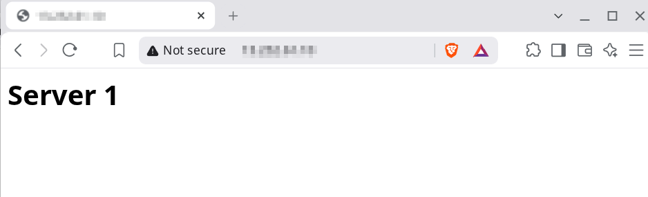

# Simple setup of an EC2 instance
I lauched an EC2 instance on my AWS. Since I'm using Free tier there were only few instance type like ```t3.micro``` ```t3.small``` ```c7i-flex.large``` ```m7i-flex.large``` were available. Several OS were available including Amazon linux, MacOs, Ubuntu, Windows, RedHat, SUSE Linux, Debian etc.

### My Setup
AMI : ```Amazon Linux 2023```

Architecture type: ```64-bit(x86)```

Instance type: ```t3.micro```

Other than that I enabled ssh,http,https using a security group also added a key-pair to the instance.

## Login via SSH

We can access the EC2 instance terminal using SSH. Use the command:
``` bash
ssh -i key.pem ec2-user@<public-ip-address>
```
``` bash
   ,     #_                                                                
   ~\_  ####_        Amazon Linux 2023                                     
  ~~  \_#####\                                                             
  ~~     \###|                                                             
  ~~       \#/ ___   https://aws.amazon.com/linux/amazon-linux-2023        
   ~~       V~' '->                                                        
    ~~~         /                                                          
      ~~._.   _/                                                           
         _/ _/                                                             
       _/m/'                                                               
Last login: Tue Aug 18 04:51:39 2026 from 106.76.185.151                   
[ec2-user@ip-172-31-5-141 ~]$ 
```
## Web Server (Nginx)

Installed and enabled nginx server using the command:
``` bash
sudo yum install nginx -y
sudo systemctl start nginx
```
Made an index.html file and stored it in ``` /usr/share/nginx/html/``` for testing purpose.
Content of html:
``` html
<html>
    <body>
        <h1> Server 1 </h1>
    </body>
</html>
```
Now to check whether the server is up and running using a browser search ```http://<public-ip-address-of-ec2>```.

Result:



## Some Findings

* Stoping and Starting an instance cause a change in the IP Address of the instance.
* Can use an Elastic IP to eliminate this problem.
* Some web browsers have problem loading http web pages if https is not enabled in the security group.
