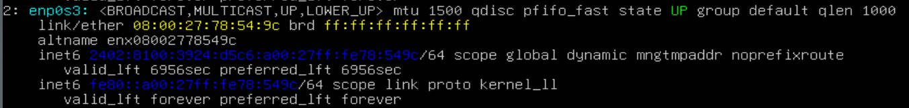
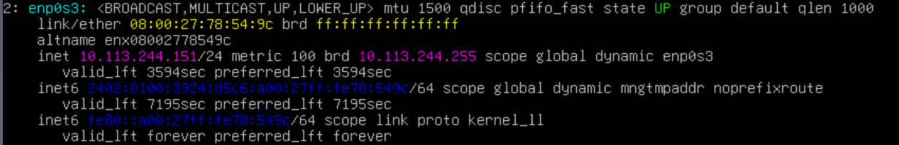
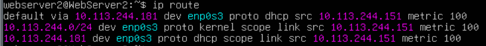

# Ubuntu server VM not receiving an IPv4 address.

## Problem

While trying to SSH into one of my Ubuntu Server VM, the connection failed. I opened my VM directly through VirtualBox to investigate the network configuration.
My VM use a **Bridged Adapter** , I have a similar webserver VM with similar setup but it is working fine.

## Initial Observation

I checked the network interface using ``` ip addr ```.



The interface ```enp0s3``` is UP, but there is only IPv6(```inet6```), for IPv4 config we must be seeing something like ```inet```.
Since the IPv6 config was working the VM had internet access.

Checking the routing table ```ip route```: no IPv4 route present.

### Assumptions

* DHCP request could be failing.
* IPv4 DHCP is not enabled in netplan config.

## Configuration Check
Netplan configuration is found on *.yaml* file found in ```/etc/netplan```

``` yaml
 # This is the network config written by 'subiguity'
network :
    ethernets:
        enp0s3:
            match:
                macaddress: 08:00:27:78:54:9c
            set-name: enp0s3
    version: 2 
``` 
The part ```dhcp4:``` is missing here.

For reference how it could be:

``` yaml
 # This is the network config written by 'subiguity'
network :
    ethernets:
        enp0s3:
            dhcp4: true
            dhcp6: true
            match:
                macaddress: 08:00:27:2f:b0:03
            set-name: enp0s3
    version: 2 
```

## Fix
Make necessary changes to the ```.yaml``` file.
After saving the config to apply the neplan use the command ```sudo netplan apply```
Now check the ```ip addr```:



Now the routing table:

